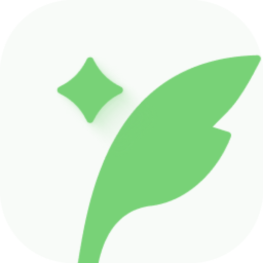
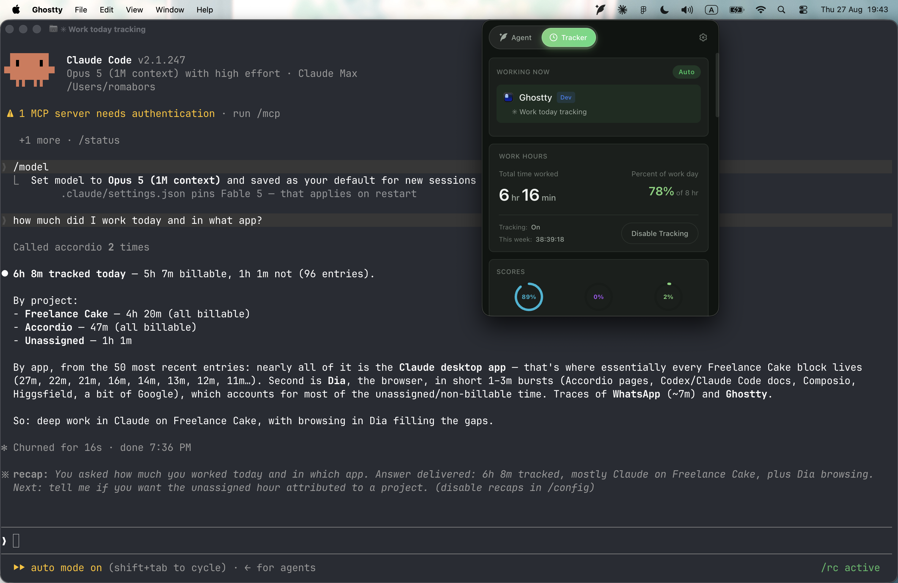
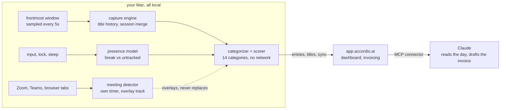

<div align="center">



# Accordio tracker

**A macOS menu bar app that watches what you actually work on, attributes it to a client or a project, and hands the result to something that can bill for it.**

[](#install)
[](#install)
[](LICENSE)
[](https://accordio.ai/claude)

[Install](#install) · [How it works](#the-four-pieces-that-do-the-work) · [What leaves your machine](#what-leaves-your-machine) · [Works with Claude](#works-with-claude) · [Build from source](#build-from-source)

<br>



</div>

Most time trackers ask you to remember. This one samples the frontmost window every 5 seconds, notices when you stopped, notices when you were in a call, and sorts the result into 14 categories without asking you anything. What you do with the total is up to you. Accordio turns it into an invoice, and if you connect your AI, [Claude can read the day and draft that invoice from chat](https://accordio.ai/claude).

macOS 12 or later, Apple Silicon and Intel. MIT licensed.

---

## Install

```sh
brew install --cask accordio-ai/tap/accordio
```

Or download the disk image directly: [Apple Silicon](https://app.accordio.ai/api/download/mac?arch=arm64) · [Intel](https://app.accordio.ai/api/download/mac?arch=x64).

On first launch macOS asks for Accessibility permission. The tracker needs it to read the frontmost window title, which is the whole mechanism. Deny it and the app runs but records nothing.

---

## How a day gets measured



Four pieces do the work. They are the interesting part of this repository and each one exists because a simpler version of it was wrong.

## The four pieces that do the work

### The capture engine

`src/main/activity-monitor.ts`

Polls the frontmost window every 5 seconds through `active-win`, and keeps a title history per app session rather than a single label, because "Chrome" is not an activity and "Chrome, PR #412 review" is. Consecutive samples of the same app merge into one entry, with a 30 second grace period so alt-tabbing to a terminal and back does not shred a focus block into confetti.

Optional browser tab reading goes through AppleScript (`src/main/applescript-bridge.ts`) rather than an extension, so nothing gets installed into your browser.

### The idle trap

Also `activity-monitor.ts`, and the reason the file is not small.

Naive idle detection treats every absence the same and quietly bills you for lunch. This one separates three cases and only one of them is a break:

| Reason | What happened | Counted as |
|---|---|---|
| `idle` | No input for 10 minutes, machine awake | A break you took |
| `locked` | Screen locked | Untracked, not leisure |
| `suspended` | Machine slept | Untracked, not leisure |

The distinction matters because a locked Mac and a sleeping Mac cannot tell you what you were doing, while an idle one can still be in a meeting. Which leads directly to the next piece.

### The meeting detector

`src/main/meeting-detector.ts`

A 40 minute Teams call where you take notes in Notion, screen-share Figma, and then just listen used to be recorded as about 9 minutes of Teams. The frontmost-window sampler simply cannot see a call, because a call is not a focused window.

So this runs on its own timer, fully outside the activity poll. It never consults idle state, pause state, or the excluded-apps list, because being detectable while HID-idle is the entire point. It watches Zoom and Teams window titles and browser tabs for a call-active signal, then emits an overlay track rather than replacing app entries, so project attribution survives the call.

It is deliberately biased toward false negatives. This feeds a billing product. A missed meeting you can add by hand. An invented one you cannot take back.

### The categorizer

`src/shared/categories.ts` plus 238 app and domain rules in the capture engine.

14 categories, split into focus work, shallow work, and non-work, resolved locally. No network call, no model, no round trip. The scorer also resolves the overlap when a meeting sits on top of app entries.

This file is a deliberate mirror of the server's taxonomy, and `npm run check:categories` fails the build if the two drift. When they disagree, the menu bar and the web dashboard report different numbers for the same day, which is the single worst bug this product can ship.

---

## What leaves your machine

Worth being precise about, since the app reads your window titles.

Tracking runs locally. Categorization runs locally. Syncing does not: the app is a client for a hosted backend at `app.accordio.ai`, and entries, app names, and window titles are sent there so the web dashboard and the invoicing side can see them. That needs a free account.

Your sign-in token is encrypted with Electron `safeStorage`, which means the macOS Keychain, not a constant key baked into the app bundle.

Crash reporting is off unless a `SENTRY_DSN` is present in the environment at build time. A build you make yourself has none, so it reports nothing.

If you want a tracker that never talks to a server, this is a reasonable thing to fork. The capture engine, the idle trap, the meeting detector, and the categorizer have no server dependency between them.

## Works with Claude

Accordio ships a remote MCP connector, so Claude can see the time this app measures. Connect it and "what did I work on this week", "how much of that is unbilled", and "draft the invoice" become chat turns, on claude.ai, in the Claude apps, or in Claude Code:

```sh
claude mcp add --transport http accordio https://mcp.accordio.ai/mcp
```

The connector reads, logs, and drafts. It never sends, signs, or deletes anything. Setup and the full tool list: [accordio.ai/claude](https://accordio.ai/claude).

## The chat companion

The app also carries a chat tab that talks to your Accordio account, so you can ask what you worked on, start and stop timers by name, and pull up recent work without opening the dashboard. It is a convenience on top of the tracker, not the reason the tracker exists.

---

## Build from source

```sh
git clone https://github.com/accordio-ai/accordio-tracker.git
cd accordio-tracker
npm install
npm run dev
```

`npm run dev` starts Vite and launches Electron against it.

Requirements: Node 20 or later, macOS, and Xcode Command Line Tools (`xcode-select --install`) so `active-win` can compile its native module.

To produce a disk image:

```sh
npm run build            # typecheck, compile main and preload, bundle renderer
SKIP_NOTARIZE=true npx electron-builder --mac --arm64
```

Output lands in `release/`. Without an Apple Developer ID the build ad-hoc signs itself, which is fine locally and will be refused by Gatekeeper on anyone else's Mac. Signing and notarization are driven entirely by environment variables, documented in `.env.example`. There are no credentials in this repository.

`npm test` runs the typechecker, 58 unit tests covering duration maths and the meeting state machine, and a production build.

---

## Layout

```
src/
  main/          Electron main process
    activity-monitor.ts   capture engine, idle trap, 238 categorization rules
    meeting-detector.ts   call detection, independent timer
    time-tracker.ts       entry lifecycle and sync
    applescript-bridge.ts browser tab and window title reading
    auth.ts               token storage via safeStorage
  shared/
    categories.ts         taxonomy and scoring, mirrored from the server
  renderer/      React UI, tracker and chat tabs
scripts/
  afterPack.js            Electron fuses, locale pruning, ad-hoc signing
  check-categories.mjs    taxonomy drift guard
  notarize.js             Apple notarization
tests/                    node:test, no framework
```

## Contributing

Issues and pull requests welcome. Two things to know before you start:

The taxonomy in `src/shared/categories.ts` is mirrored from the server and guarded by a check script. Changing a category here without changing it there breaks the build on purpose.

The meeting detector's bias is a product decision, not an oversight. Patches that make it more eager need to argue why a wrongly billed hour is acceptable.

## License

MIT. See [LICENSE](LICENSE).

The integration logos in `assets/integrations/` and the Accordio brand marks in `design/` and `build/` belong to their respective owners and are not covered by that grant.
